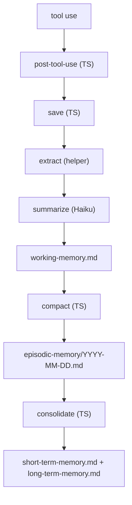

# Continuous Memory for Claude Code

Claude Code starts every session blank. It doesn't know what you worked on yesterday, what conventions your team follows, or what mistakes it already made. You re-explain everything, every time.

Claude Remember fixes that. It hooks into Claude Code's lifecycle — saving sessions automatically, compressing them through Haiku into layered summaries, and loading them back into context on the next session start. No manual prompting, no copy-pasting notes. The agent starts every session with its history already present.

The result: your Claude Code instance develops continuity. It remembers what it learned, what broke, what worked. Not perfect recall — compressed, practical memory that fits in minimal tokens.

## Install

### From the NexusFlow marketplace (recommended)

Add the NexusFlow marketplace once, then install:

```
/plugin marketplace add nxsflow/plugin-marketplace
/plugin install claude-memory@nxsflow
```

To update later:

```
/plugin marketplace update
```

### Direct clone (alternative)

Clone straight into your project's `.claude/` directory and install:

```bash
git clone https://github.com/nxsflow/claude-memory.git <your-project>/.claude/claude-memory
cd <your-project>/.claude/claude-memory && npm install
```

`npm install` triggers the `prepare` script which bundles `dist/entrypoints/*.mjs` — that's what the hooks call.

To update later:

```bash
git -C <your-project>/.claude/claude-memory pull && cd <your-project>/.claude/claude-memory && npm install
```

Then wire up the hooks in `settings.json` — see [Setup](#setup) below.

### Check your version

Look at the `version` field in `.claude-plugin/plugin.json`.

### Changelog

_No releases yet._

## How it works



Each layer compresses the one above it. Raw exchanges become one-line summaries. Daily episodes
become condensed multi-day blocks. The result: full context in minimal tokens.

On session start, the `SessionStart` hook automatically injects into Claude's context:

- `agent-role.md` — the agent's role and values
- `session-handover.md` — the handover note from the last session (one-shot, then cleared)
- `episodic-memory/<today>.md` — today's episode so far
- `working-memory.md` — current session buffer
- `short-term-memory.md` — past ~7 days consolidated
- `long-term-memory.md` — older history consolidated

No manual prompting, no "read this file" instructions. The agent begins every session with its memory already loaded. It just remembers.

## Cost

The pipeline uses Claude Haiku for summarisation and compression. Haiku is the smallest, cheapest Claude model. A typical session save costs **< $0.01** — a few thousand input tokens (the session exchanges) and a few hundred output tokens (the summary). Compact and consolidation add a few more Haiku calls.

In practice, running this all day costs **a few cents per day**. The Anthropic API key used by the Claude CLI is the same one that powers the calls — no separate billing.

## Requirements

- Node 20+
- `claude` CLI with Haiku access

## Setup

1. Copy `.claude/claude-memory/` into your project's `.claude/` directory.
2. Add the hooks to your `.claude/settings.json`:

```json
{
  "hooks": {
    "SessionStart": [
      {
        "hooks": [
          {
            "type": "command",
            "command": "node \"${CLAUDE_PLUGIN_ROOT}/dist/entrypoints/session-start.mjs\" 2>> \"${CLAUDE_PROJECT_DIR:-.}/.claude-memory/logs/hook-errors.log\""
          }
        ]
      }
    ],
    "PostToolUse": [
      {
        "hooks": [
          {
            "type": "command",
            "command": "node \"${CLAUDE_PLUGIN_ROOT}/dist/entrypoints/post-tool-use.mjs\" 2>> \"${CLAUDE_PROJECT_DIR:-.}/.claude-memory/logs/hook-errors.log\""
          }
        ]
      }
    ]
  }
}
```

1. Write your agent's role in `.claude-memory/agent-role.md` (see `agent-role.example.md`).
2. Set **Auto-compact** to `false` in Claude Code preferences (`/config`) — auto-compact discards conversation history before the save pipeline can capture it. [Why this matters](https://max.dp.tools/posts/12-context-is-a-trap.php)
3. Enable the **status line** in Claude Code (`/statusline`) to see your current context usage — when context gets high, it's time to save and start a new session.

## Hooks

The plugin registers two Claude Code hooks:

| Hook           | Entrypoint                           | Purpose                                                          |
| -------------- | ------------------------------------ | ---------------------------------------------------------------- |
| `SessionStart` | `dist/entrypoints/session-start.mjs` | Load memory files into context, trigger recovery + consolidation |
| `PostToolUse`  | `dist/entrypoints/post-tool-use.mjs` | Auto-save session when JSONL delta exceeds threshold             |

## Handover between sessions (`/session-handover`)

Before ending a session (end of day, shutting down, closing the laptop), type `/session-handover`. The agent writes a short handover note to `.claude-memory/session-handover.md` — what's done, what's next, any non-obvious context. The next session reads it and picks up where you left off. This is complementary to the automatic pipeline: the pipeline captures what happened, the handover captures what matters next.

## Data files

The pipeline writes to `.claude-memory/` inside your project (created automatically, self-gitignored):

| File                                           | Purpose                                                  |
| ---------------------------------------------- | -------------------------------------------------------- |
| `.claude-memory/working-memory.md`             | Current session buffer — timestamped one-liners per save |
| `.claude-memory/episodic-memory/YYYY-MM-DD.md` | Daily compressed summaries                               |
| `.claude-memory/short-term-memory.md`          | Consolidated past ~7 days                                |
| `.claude-memory/long-term-memory.md`           | Consolidated older history                               |
| `.claude-memory/core-memories.md`              | Key identity-defining moments (you write this)           |
| `.claude-memory/session-handover.md`           | One-shot handover note written by `/session-handover`    |
| `.claude-memory/agent-role.md`                 | Your agent's role and values (you write this)            |
| `.claude-memory/logs/`                         | Pipeline logs                                            |
| `.claude-memory/tmp/`                          | Lock files, cooldown markers                             |

## Configuration

Drop a `config.json` next to `.claude-plugin/plugin.json` in the plugin install directory to override any of the defaults below. Every key is optional — missing keys fall back to the defaults (see `src/helpers/config.ts`).

| Key                            | Default | Purpose                                           |
| ------------------------------ | ------- | ------------------------------------------------- |
| `cooldowns.saveSeconds`        | `120`   | Minimum seconds between saves                     |
| `cooldowns.compactSeconds`     | `3600`  | Minimum seconds between compact runs              |
| `thresholds.minHumanMessages`  | `3`     | Minimum human messages before saving              |
| `thresholds.deltaLinesTrigger` | `50`    | JSONL line delta that triggers auto-save          |
| `features.recovery`            | `true`  | Recover missed saves on session start             |
| `timezone`                     | `UTC`   | Timezone for timestamps and daily file boundaries |

## Running tests

```bash
npm install && npm test
```

## Architecture

```
src/entrypoints/    TypeScript — session-start, post-tool-use, save, compact, consolidate
src/helpers/        TypeScript — config, paths, logger, lock, cooldown, jsonl, haiku, prompts, memory-files
prompts/            Haiku prompt templates ({{PLACEHOLDER}} substitution)
hooks/hooks.json    Hook registration — SessionStart + PostToolUse → dist/entrypoints/*.mjs
skills/             /session-handover slash command
tests/              vitest suite (118 tests)
```

## License

Licensed under the [Apache License 2.0](LICENSE).
